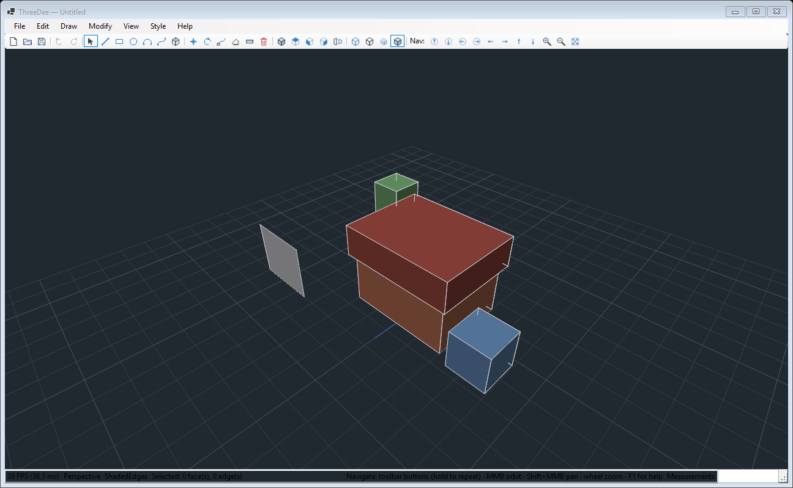
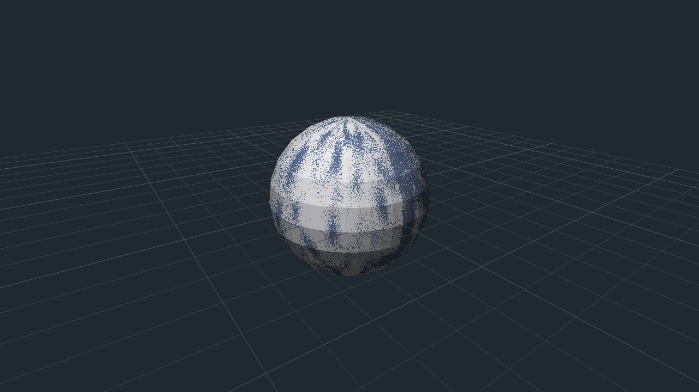

# MintPlayer.ThreeDee

A SketchUp-style 3D modeling engine for **Windows Forms** — half-edge mesh, software rasterizer,
orbit camera, ray picking, and sketch / push-pull / follow-me tools. No GPU, no external
dependencies: just `System.Numerics`, GDI+ and the BCL.



## What this project is for

This is an **informative how-to project**. Its purpose is to open up 3D drawing for WinForms
developers — a corner of .NET desktop work that usually means reaching for a game engine or a
native interop layer. Everything here is deliberately readable: you can follow a mouse click from
the WinForms event, through an unprojected ray, into a half-edge topology edit, and back out to a
rasterized bitmap, without leaving C#.

So the code is written to be **read**, not just consumed. If you are scanning the repository to
learn how a modeler works, start with [How it works](#how-it-works) below and follow the file
pointers.

## Documentation

| Document | What's in it |
|----------|--------------|
| **[docs/quaternions.md](docs/quaternions.md)** | **Quaternions and 3D rotations** — the theory and essentials, from first principles. Why unit quaternions represent rotations at all, where the half-angle comes from, the sandwich product, the double cover, slerp, how they relate to rotation matrices, and — honestly — which rotation edge cases they do *not* solve. Runnable C# throughout, and it ends with a **complete single-file WinForms program that spins a shaded icosahedron** using nothing but `System.Drawing` and `Application.DoEvents()`. Standalone: no knowledge of this codebase required. |
| **[docs/ARCHITECTURE.md](docs/ARCHITECTURE.md)** | Design decisions and why they went that way: render backend, hidden-surface removal, mesh topology, picking. Includes the measured spike results behind each fork and the milestone roadmap. |
| **[docs/PRD.md](docs/PRD.md)** | Product requirements — the feature list, performance targets, and numbered requirements (`R11.1-1`, …) that the implementation is held to. |

## Quick start

```
dotnet run --project MintPlayer.ThreeDee.Demo
```

Then: **MMB-drag** to orbit, **Shift+MMB** to pan, **wheel** to zoom (zoom-to-cursor), **F1** for
help. Draw with `L` (line), `R` (rectangle), `Space` (select); push/pull a face to make it solid.

To use the engine in your own app, reference the library project:

```
dotnet add reference ../ThreeDee/MintPlayer.ThreeDee/MintPlayer.ThreeDee.csproj
```

The library targets `net10.0-windows` with `UseWindowsForms`, and is packable as
`MintPlayer.ThreeDee` if you'd rather build and consume it as a NuGet package.

## How it works

The engine is a pipeline of small, independently understandable layers. Each row is a real
directory in [`MintPlayer.ThreeDee`](MintPlayer.ThreeDee).

| Layer | Directory | What it does |
|-------|-----------|--------------|
| **Geometry** | `Geometry/` | Half-edge mesh (`Vertex`, `HalfEdge`, `Face`, `Mesh`). Shared topology is what makes push/pull stitch into neighbours and lets edge loops be walked. `MeshBuilder` has primitives; `LoopFinder` detects closed planar wire loops and auto-fills them into faces. |
| **Math** | `Math/` | `Tessellation` turns curves into polylines (adaptive Bézier flattening, 3-point arc, circle/N-gon). `Ray`, `BoundingBox`. |
| **Rendering** | `Rendering/` | `SoftwareRasterizer` — per-pixel Z-buffer into a GDI+ `Bitmap` via `LockBits`. `Camera` (orbit in azimuth/elevation/distance, perspective or ortho, project/unproject). `Picker` casts rays at triangles and segments. `Shading`, `SelectionOverlay`, `RenderStyle`. |
| **Commands** | `Commands/` | Every mutation is an undoable `ICommand` pushed onto `History`. `PushPullCommand`, `FollowMeCommand`, `EditCommands` (move/rotate/delete), `CreateFaceCommand`. |
| **Tools** | `Tools/` | The interactive layer: `LineTool`, `RectangleTool`, `CircleTool`, `ArcTool`, `BezierTool`, `PushPullTool`, `MoveTool`, `RotateTool`, `FollowMeTool`, `EraserTool`, `TapeMeasureTool`. A tool receives mouse/key events and commits a command. |
| **Inference** | `Inference/` | The snapping engine: endpoint / midpoint / on-edge / on-face plus axis lock, with tolerances specified in *pixels* and unprojected at the candidate's depth so distant geometry doesn't snap too eagerly. |
| **Persistence** | `Persistence/` | `SceneIO` reads/writes the native `.3dee` JSON; `MeshExport` writes Wavefront OBJ and ASCII STL. |

### The render loop

Rendering is a pure function of scene + camera, which makes it easy to reason about and to test
headlessly:

```csharp
using var renderer = new SoftwareRasterizer();
renderer.Resize(camera.ViewportWidth, camera.ViewportHeight);

Bitmap frame = renderer.RenderFrame(
    scene.BuildRenderMeshes(),   // one RenderMesh per face
    [.. scene.WireLines()],      // loose edges, grid, axes — WireLines() is lazy, so materialize it
    camera,
    RenderStyle.ShadedEdges);
```

### Hosting it in a WinForms control

There is no custom designer control to drop on a form — you own the `Control` and drive the
engine from its events. The demo's
[`ViewportControl`](MintPlayer.ThreeDee.Demo/ViewportControl.cs) is the reference implementation;
the essentials are:

```csharp
public sealed class Viewport : Control
{
    readonly IRenderer _renderer = new SoftwareRasterizer();
    readonly Camera _camera = new();
    readonly Scene _scene = new();
    readonly Selection _selection = new();
    readonly History _history = new();
    readonly Picker _picker;
    readonly ToolContext _ctx;

    // Snapshot of what to draw. Rebuilt when the scene CHANGES, not on every paint.
    readonly List<RenderMesh> _meshes = [];
    readonly List<WorldLine> _lines = [];

    ITool _tool = new SelectTool();

    public Viewport()
    {
        // Opaque + UserPaint + double buffering: we blit a whole bitmap, so let no one else paint.
        SetStyle(ControlStyles.AllPaintingInWmPaint | ControlStyles.Opaque
               | ControlStyles.UserPaint | ControlStyles.OptimizedDoubleBuffer, true);

        _picker = new Picker(_scene.Mesh);
        _ctx = new ToolContext(_scene, _camera, _picker, _selection, _history,
                               Invalidate, RebuildScene);
        _history.Changed += RebuildScene;   // undo/redo must re-snapshot too
        RebuildScene();
        _tool.Activate(_ctx);
    }

    void RebuildScene()
    {
        _meshes.Clear();
        _meshes.AddRange(_scene.BuildRenderMeshes());
        _lines.Clear();
        _lines.AddRange(_scene.WireLines());   // lazy, so materialize into the cached list
        Invalidate();
    }

    protected override void OnResize(EventArgs e)
    {
        base.OnResize(e);
        if (ClientSize.Width > 0 && ClientSize.Height > 0)
        {
            _camera.ViewportWidth = ClientSize.Width;
            _camera.ViewportHeight = ClientSize.Height;
            _renderer.Resize(ClientSize.Width, ClientSize.Height);
        }
    }

    protected override void OnPaint(PaintEventArgs e)
    {
        var frame = _renderer.RenderFrame(_meshes, _lines, _camera, RenderStyle.ShadedEdges);
        e.Graphics.DrawImageUnscaled(frame, 0, 0);
        SelectionOverlay.DrawSelection(e.Graphics, _camera, _selection);
        _tool.DrawOverlay(e.Graphics, _ctx);   // rubber bands, snap indicators
    }

    // Route input to the active tool; keep navigation (orbit/pan/zoom) tool-independent.
    protected override void OnMouseDown(MouseEventArgs e)
        => _tool.OnMouseDown(_ctx, e.Button, e.Location, ModifierKeys);
}
```

Switching tools is just assigning `_tool` and calling `Activate`. Undo/redo is `_history.Undo()` /
`_history.Redo()` — because tools never touch the mesh directly, only commands do, which is also why
subscribing to `History.Changed` is enough to keep the render snapshot current.

### Building geometry in code

You don't need the UI to model. This sweeps a circular profile around a circular path to get an
exact sphere:

```csharp
var scene = new Scene();
var profile = scene.Mesh.MakeFace(
    Tessellation.Polygon(Vector3.Zero, Vector3.UnitX, Vector3.UnitY, radius: 2.5f, n: 24));

var path = Tessellation.Polygon(Vector3.Zero, Vector3.UnitX, Vector3.UnitZ, radius: 2.5f, n: 48);
path.Add(path[0]);                       // close it -> exact surface of revolution

new FollowMeCommand(scene.Mesh, profile, path).Do();
scene.Mesh.RemoveFace(profile);          // drop the construction profile
```



Follow-Me is where the rotation math actually lives — see
[docs/quaternions.md](docs/quaternions.md) for the theory, and
`Commands/FollowMeCommand.cs` for the two branches it picks between (exact revolution for a
planar closed path, parallel-transport sweep otherwise).

## Verifying without a screen

The demo doubles as a headless verification harness — each switch renders one frame to a PNG and
exits, which is how the features in this repo are checked in CI and how the images above were
produced:

```
dotnet run --project MintPlayer.ThreeDee.Demo -- --screenshot scene.png   # the demo scene
dotnet run --project MintPlayer.ThreeDee.Demo -- --formshot   app.png     # whole window
dotnet run --project MintPlayer.ThreeDee.Demo -- --sphereshot sphere.png  # Follow-Me revolution
dotnet run --project MintPlayer.ThreeDee.Demo -- --followshot follow.png  # Follow-Me sweep
dotnet run --project MintPlayer.ThreeDee.Demo -- --pullshot   box.png     # rectangle -> push/pull
dotnet run --project MintPlayer.ThreeDee.Demo -- --drawshot   draw.png    # Line tool
dotnet run --project MintPlayer.ThreeDee.Demo -- --infershot  snap.png    # axis lock + snapping
dotnet run --project MintPlayer.ThreeDee.Demo -- --pickshot   pick.png    # selection + hover
dotnet run --project MintPlayer.ThreeDee.Demo -- --planeshot  plane.png   # work planes
dotnet run --project MintPlayer.ThreeDee.Demo -- --loopshot   loop.png    # auto-fill wire loop
dotnet run --project MintPlayer.ThreeDee.Demo -- --m7shot     curves.png  # arcs + Bézier
```

## Tests

A hand-rolled, BCL-only regression harness — no third-party test framework, in keeping with the
rest of the project. Exit code `0` means every assertion passed.

```
dotnet run --project MintPlayer.ThreeDee.Test
```

It covers half-edge invariants (Euler characteristic, manifoldness, outward normals), the extrude
kernel, picking and unprojection, tools end-to-end, tessellation accuracy, save/load round-trips,
export, and Follow-Me sphericity.

## License

Apache-2.0.
