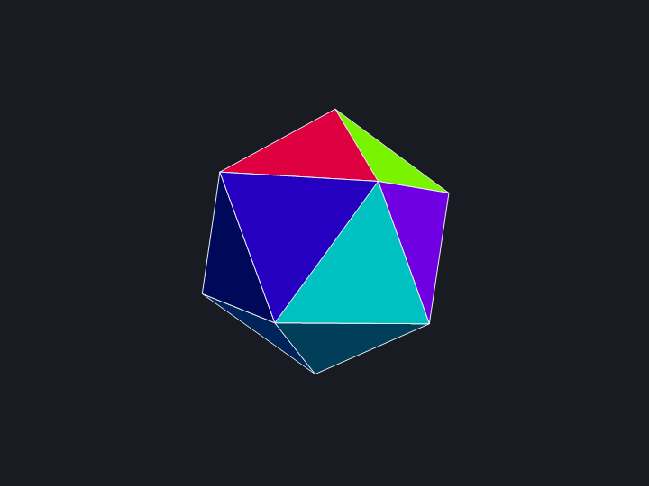

# Quaternions — theory and essentials

A standalone reference on quaternions and their relationship to 3D rotations. Nothing here depends
on this project; it is written for anyone who wants to understand *why* unit quaternions represent
rotations, not merely which library function to call.

The aim is intuition first, then the formulas you'd actually implement, then an honest account of
what quaternions do **not** solve — because the folklore around that last part causes real bugs.

**Contents**

1. [Why quaternions at all](#1-why-quaternions-at-all)
2. [The algebra](#2-the-algebra)
3. [Conjugate, norm, inverse](#3-conjugate-norm-inverse)
4. [Unit quaternions are rotations](#4-unit-quaternions-are-rotations)
5. [Rotating a vector](#5-rotating-a-vector)
6. [Composition](#6-composition)
7. [The double cover](#7-the-double-cover-q-and-q)
8. [Relationship to rotation matrices](#8-relationship-to-rotation-matrices)
9. [Interpolation: nlerp and slerp](#9-interpolation-nlerp-and-slerp)
10. [Euler angles and gimbal lock](#10-euler-angles-and-gimbal-lock)
11. [Numerical behaviour](#11-numerical-behaviour)
12. [The shortest arc between two vectors](#12-the-shortest-arc-between-two-vectors)
13. [What quaternions do NOT solve](#13-what-quaternions-do-not-solve)
14. [Choosing a representation](#14-choosing-a-representation)
15. [Gotchas](#15-gotchas)
16. [A complete runnable demo](#16-a-complete-runnable-demo)
17. [Further concepts](#17-further-concepts)

---

## 1. Why quaternions at all

A rotation in 3D has exactly **three degrees of freedom**. So the obvious move is to describe one
with three numbers — yaw, pitch, roll. That works for *storing* a single orientation and it is
pleasant for humans, but it is bad at the operation you actually perform most: **combining
rotations**. Composing two sets of Euler angles means converting both to matrices, multiplying, and
converting back, and the parameterization has places where it degenerates (§10).

The deep reason is topological. The set of 3D rotations, `SO(3)`, is a curved 3-dimensional space,
and it cannot be covered smoothly by a single 3-parameter chart — any three-number scheme has
singularities somewhere, the same way any flat map of the Earth must tear or stretch somewhere.

Quaternions sidestep this by using **four** numbers with **one constraint** (`|q| = 1`). Four
numbers on a constraint surface is still a 3-dimensional space, but now the description is smooth
and singularity-free everywhere. And the payoff is this:

> **Quaternion multiplication *is* rotation composition.**

Composing rotations becomes one multiplication — no trigonometry, no conversion, no special cases.
That single fact is the entire reason quaternions are used in graphics, robotics, and simulation.
Everything below is elaboration on it.

---

## 2. The algebra

A quaternion is four real numbers written with three distinct imaginary units:

```
q = w + x·i + y·j + z·k
```

`w` is the **scalar** (or real) part; `(x, y, z)` is the **vector** (or imaginary) part. It is
almost always more useful to group them:

```
q = (w, v)        where v = (x, y, z)
```

The units satisfy Hamilton's relations:

```
i² = j² = k² = ijk = -1
```

From which the products follow:

```
ij =  k        jk =  i        ki =  j
ji = -k        kj = -i        ik = -j
```

Note carefully: **the units anti-commute**. `ij = -ji`. This makes quaternion multiplication
non-commutative, which is not a defect — it is *necessary*. Rotations don't commute either: rotate
90° about X then 90° about Y and you land somewhere different than the reverse order. A commutative
algebra could not possibly model rotation composition.

### The Hamilton product

Multiplying out and collecting terms gives the component form:

```
q1·q2 = ( w1w2 - x1x2 - y1y2 - z1z2,
          w1x2 + x1w2 + y1z2 - z1y2,
          w1y2 - x1z2 + y1w2 + z1x2,
          w1z2 + x1y2 - y1x2 + z1w2 )
```

But the scalar/vector form is the one worth memorizing, because it shows the structure:

```
(w1, v1)·(w2, v2) = ( w1w2 - v1·v2 ,  w1v2 + w2v1 + v1 × v2 )
                      \_________/     \_______________________/
                       scalar part            vector part
```

The dot product and the cross product both fall out of a single multiplication. And the cross
product term is exactly where non-commutativity lives: swapping the operands flips `v1 × v2` and
leaves every other term alone.

Cost: **16 multiplications and 12 additions**.

In C#, written out in the scalar/vector form so the structure stays visible — this is exactly what
`Quaternion`'s `*` operator does:

```csharp
using System.Numerics;

static Quaternion Multiply(Quaternion a, Quaternion b)
{
    Vector3 va = new(a.X, a.Y, a.Z);
    Vector3 vb = new(b.X, b.Y, b.Z);

    float  scalar = a.W * b.W - Vector3.Dot(va, vb);
    Vector3 vector = a.W * vb + b.W * va + Vector3.Cross(va, vb);
    //                                     ^^^^^^^^^^^^^^^^^^^^^^
    //            the cross product is the entire source of non-commutativity

    return new Quaternion(vector, scalar);   // note: ctor takes (vector, scalar)
}

// Anti-commutativity is easy to see for yourself:
var i = new Quaternion(1, 0, 0, 0);   // x=1  -> the unit i
var j = new Quaternion(0, 1, 0, 0);   // y=1  -> the unit j
Multiply(i, j);   // =>  (0, 0,  1, 0)  =  k
Multiply(j, i);   // =>  (0, 0, -1, 0)  = -k
```

---

## 3. Conjugate, norm, inverse

```
conjugate:   q* = (w, -v)
norm:        |q|² = w² + x² + y² + z²  =  w² + v·v
inverse:     q⁻¹ = q* / |q|²
```

The inverse follows from `q·q* = (w² + v·v, 0) = |q|²`, a pure scalar.

The practical consequence matters enormously:

> For a **unit** quaternion, `|q|² = 1`, so `q⁻¹ = q*` — the inverse is just three sign flips.

Inverting a rotation costs nothing. (Compare inverting a general matrix, or even transposing one.)
This is why implementations keep quaternions normalized as an invariant rather than as an
occasional cleanup: almost every useful identity assumes `|q| = 1`.

```csharp
var q = Quaternion.CreateFromAxisAngle(Vector3.UnitY, MathF.PI / 4);   // 45° about +Y

Quaternion.Conjugate(q);        // (w, -v)
Quaternion.Inverse(q);          // q* / |q|²  — same as Conjugate when |q| == 1
q.Length();                     // 1 (up to float error)
Quaternion.Normalize(q);        // restore |q| == 1 exactly

// For a unit quaternion these two agree, so prefer Conjugate on a hot path:
// it is three sign flips, where Inverse also computes and divides by |q|².
```

---

## 4. Unit quaternions are rotations

A rotation by angle `θ` about a **unit** axis `n̂` is the quaternion

```
q = ( cos(θ/2),  sin(θ/2)·n̂ )
```

```
              n̂
              ↑
              |    ●  rotate by θ about n̂
              |   ╱
              |  ╱                    q = (cos(θ/2), sin(θ/2)·n̂)
              | ╱  θ
              |╱________→
```

Being a unit quaternion is automatic: `cos²(θ/2) + sin²(θ/2)|n̂|² = 1`.

### Where the half-angle comes from

This is the part that looks arbitrary and isn't. The reason is that the rotation formula (§5)
applies `q` **twice** — once on each side of the vector:

```
v' = q · v · q⁻¹
     ↑         ↑
     two multiplications by q, so the angle lands twice
```

Each multiplication contributes `θ/2`, and the two together deliver the full `θ`. Store half the
angle, apply it twice, get the whole angle. Once you see the sandwich, the half-angle stops being a
convention to memorize and becomes the only value that *could* work.

A useful sanity check: `θ = 0` gives `q = (1, 0, 0, 0)`, the multiplicative identity — the rotation
that does nothing is the number one. And `θ = 360°` gives `q = (cos 180°, sin 180°·n̂) = (-1, 0)`,
which is *not* the identity, a fact §7 makes sense of.

### Worked example

A 90° rotation about the +Y axis, `n̂ = (0, 1, 0)`, `θ = 90°`, so `θ/2 = 45°`:

```
q = ( cos 45°,  sin 45°·(0,1,0) )
  = ( 0.70711,  (0, 0.70711, 0) )
```

```csharp
// By hand, straight from the definition — note the halving:
static Quaternion FromAxisAngle(Vector3 axis, float angleRad)
{
    axis = Vector3.Normalize(axis);          // REQUIRED: a non-unit axis gives a non-unit quaternion
    float half = angleRad * 0.5f;            // <-- the half-angle
    return new Quaternion(axis * MathF.Sin(half), MathF.Cos(half));
}

var q = FromAxisAngle(Vector3.UnitY, MathF.PI / 2);   // 90° about +Y
// q == (X:0, Y:0.70711, Z:0, W:0.70711)

// The BCL does the same thing:
var same = Quaternion.CreateFromAxisAngle(Vector3.UnitY, MathF.PI / 2);

// Sanity checks worth writing once:
Quaternion.Identity;                                        // (0,0,0,1) — the number one
FromAxisAngle(Vector3.UnitY, MathF.Tau);                    // (0,0,0,-1) — a full turn is NOT identity (§7)
```

---

## 5. Rotating a vector

Embed the vector as a **pure** quaternion (zero scalar part), `v → (0, v)`, then conjugate:

```
v' = q · v · q⁻¹          (for unit q, = q · v · q*)
```

The result always comes back pure, and its length is always preserved — the sandwich product of a
unit quaternion is exactly a rotation, never a scale or a shear.

Nobody implements it as two full Hamilton products. Expanding and simplifying, with `v_q` the
vector part of `q` and `w` its scalar:

```
t  = 2·(v_q × v)
v' = v + w·t + v_q × t
```

Two cross products and a scaled add: `t` costs 9 mul + 3 add, `w·t` is 3 mul, `v_q × t` is
6 mul + 3 add, and the two vector sums are 6 add — **18 multiplications and 9 additions, 27 flops**.
Worth comparing against a 3×3 matrix-vector multiply's 9 multiplications and 6 additions, 15 flops
(§13c).

```csharp
// The expanded form, which is what a library's vector-transform actually runs:
static Vector3 Rotate(Vector3 v, Quaternion q)
{
    Vector3 vq = new(q.X, q.Y, q.Z);
    Vector3 t  = 2f * Vector3.Cross(vq, v);
    return v + q.W * t + Vector3.Cross(vq, t);
}

// Equivalent to the literal sandwich q·(0,v)·q*, which is clearer but ~2x the work:
static Vector3 RotateViaSandwich(Vector3 v, Quaternion q)
{
    var pure = new Quaternion(v, 0f);                 // embed v as a pure quaternion
    var r    = q * pure * Quaternion.Conjugate(q);    // q v q*   (unit q, so q⁻¹ == q*)
    return new Vector3(r.X, r.Y, r.Z);                // the scalar part comes back 0
}

// And the BCL one-liner you'd normally reach for:
Vector3.Transform(v, q);
```

> **Watch out:** `Vector3.Transform` is overloaded for **both** `Quaternion` and `Matrix4x4`. The two
> call sites are textually identical, so whether a line does quaternion or matrix arithmetic can
> depend only on the declared type of a variable somewhere else.

### Worked example, continued

Apply `q = (0.70711, (0, 0.70711, 0))` — the 90°-about-Y rotation — to `v = (1, 0, 0)`.
Write `s = 0.70711`, so `v_q = (0, s, 0)` and `w = s`.

```
v_q × v = (0, s, 0) × (1, 0, 0)
        = ( s·0 - 0·0 ,  0·1 - 0·0 ,  0·0 - s·1 )
        = ( 0, 0, -s )

t       = 2·(0, 0, -s) = (0, 0, -1.41421)

w·t     = 0.70711 · (0, 0, -1.41421) = (0, 0, -1)

v_q × t = (0, s, 0) × (0, 0, -2s)
        = ( s·(-2s) - 0·0 ,  0·0 - 0·(-2s) ,  0·0 - s·0 )
        = ( -2s², 0, 0 ) = ( -1, 0, 0 )

v'      = v + w·t + v_q × t
        = (1, 0, 0) + (0, 0, -1) + (-1, 0, 0)
        = (0, 0, -1)
```

So `+X → -Z`. Check it against the right-hand rule: point your right thumb along +Y and curl your
fingers; +X sweeps toward -Z. Correct. (And §8's matrix for the same rotation gives the same
answer, as it must.)

---

## 6. Composition

To apply `q1` **first** and then `q2`:

```
q_total = q2 · q1
```

Right-to-left, exactly like matrix multiplication — and for the same reason, since
`q2(q1 v q1*)q2* = (q2q1) v (q2q1)*`. Getting this backwards is the single most common quaternion
bug, and it is nasty because the result is still a perfectly valid rotation; it is just the wrong
one. Symmetric test cases (rotations about the same axis, or angles of 180°) will not catch it.
Test with two rotations about *different* axes with *different* angles.

Cost comparison for composing rotations:

| | Multiplications | Additions |
|---|---|---|
| Quaternion product | 16 | 12 |
| 3×3 matrix product | 27 | 18 |

Quaternions win on composition, and the gap widens for long chains — which, combined with §11, is
why accumulating orientation is quaternion territory.

```csharp
var yaw   = Quaternion.CreateFromAxisAngle(Vector3.UnitY, MathF.PI / 2);   // 90° about +Y
var pitch = Quaternion.CreateFromAxisAngle(Vector3.UnitX, MathF.PI / 2);   // 90° about +X

var yawThenPitch = pitch * yaw;      // yaw applied FIRST, then pitch  (right-to-left)
var pitchThenYaw = yaw * pitch;      // the other way round — a DIFFERENT rotation

// Prove to yourself that order matters, and that this is the test that catches an order bug:
Vector3.Transform(Vector3.UnitZ, yawThenPitch);   // (1, 0, 0)
Vector3.Transform(Vector3.UnitZ, pitchThenYaw);   // (0, -1, 0)
```

> Some libraries also expose a left-to-right helper — in .NET, `Quaternion.Concatenate(a, b)` means
> "`a` then `b`", i.e. the same thing as `b * a`. Pick one convention per codebase and stay with it.

---

## 7. The double cover (`q` and `-q`)

**`q` and `-q` represent the same rotation.**

Directly from the sandwich: `(-q)v(-q)⁻¹ = (-1)(-1)⁻¹ · qvq⁻¹ = qvq⁻¹`. The signs cancel.

Geometrically, the unit quaternions form the 3-sphere `S³`, and the map `S³ → SO(3)` is exactly
**two-to-one**: every rotation has precisely two quaternion representatives, antipodal on the
sphere.

```
        S³ (unit quaternions)              SO(3) (rotations)

              •  q       ─────────────────────►  ●  R
              │                              ╱
              │ antipodal                  ╱   both map to
              │                          ╱     the same rotation
              • -q       ─────────────────
```

You can feel this. Take `q = (cos(θ/2), sin(θ/2)n̂)` and let `θ` run from 0 to 360°:

- At `θ = 0`: `q = (1, 0)`. Identity.
- At `θ = 360°`: `q = (-1, 0)`. Vectors are back where they started — a full turn is the identity
  rotation — but the *quaternion* is now `-1`, not `1`.
- At `θ = 720°`: `q = (1, 0)`. Only after **two** full turns does the quaternion return to itself.

So quaternions track something slightly finer than orientation: they remember the path taken, up to
a sign. This is not a curiosity; it has two concrete consequences.

**Converting from a matrix is sign-ambiguous.** A rotation matrix determines the quaternion only up
to `±`. Any conversion routine picks one; if you round-trip through a matrix, don't expect the same
signs back.

**Interpolation must choose the shorter arc.** Two quaternions describing nearby orientations may
sit on opposite sides of `S³` and interpolate the long way round — a 350° detour instead of a 10°
turn. The fix is one line: if `q1·q2 < 0`, negate one of them. Since `-q2` is the same rotation,
this is free, and it is mandatory in any correct slerp (§9).

---

## 8. Relationship to rotation matrices

A quaternion and a rotation matrix encode the **same** element of `SO(3)`. Neither is more "real"
than the other; they are two coordinate systems on the same object, and converting between them is
routine. Matrices are what projection pipelines and GPUs consume; quaternions are what you compose,
accumulate, interpolate, and store.

### Quaternion → matrix

For a unit `q = (w, x, y, z)`:

```
        ⎡ 1-2(y²+z²)    2(xy - wz)    2(xz + wy) ⎤
    R = ⎢ 2(xy + wz)    1-2(x²+z²)    2(yz - wx) ⎥
        ⎣ 2(xz - wy)    2(yz + wx)    1-2(x²+y²) ⎦
```

Check it on the running example — but about Z this time, `q = (0.70711, 0, 0, 0.70711)`, a 90°
rotation about +Z:

```
R = ⎡ 1-2(0+0.5)      2(0 - 0.5)      0        ⎤     ⎡ 0  -1   0 ⎤
    ⎢ 2(0 + 0.5)      1-2(0+0.5)      0        ⎥  =  ⎢ 1   0   0 ⎥
    ⎣ 0               0               1-2(0+0) ⎦     ⎣ 0   0   1 ⎦
```

which maps `+X → +Y`. Correct for +90° about +Z.

> **Row-vector vs column-vector convention.** The matrix above is written in the **column-vector**
> convention (`v' = R·v`), which is standard in mathematical writing. Several graphics libraries —
> including .NET's `System.Numerics` — use the **row-vector** convention (`v' = v·M`) instead, and
> their matrix is therefore the **transpose** of the one above. Printing `Matrix4x4.CreateFromQuaternion`
> for this same 90°-about-Z rotation gives `M12 = +1, M21 = -1`, where the `R` above has
> `R[0][1] = -1, R[1][0] = +1`. Both are correct; they just disagree on which index comes first.
> Don't "fix" one to match the other — check which convention you're in, and let the library's own
> transform function apply it.

### Matrix → quaternion (numerically stable)

The naive route solves for `w` from the trace, `w = √(1 + trace)/2`, then divides the off-diagonal
differences by `4w`. That **fails near 180° rotations**, where the trace approaches `-1` and `w`
approaches zero: you divide by something tiny and the vector part is garbage.

The stable method (Shepperd / Shoemake) branches on whichever of the four candidates is largest, so
the divisor is always well away from zero:

```
trace = m00 + m11 + m22

if trace > 0:
    s = sqrt(trace + 1) * 2
    w = 0.25 * s
    x = (m21 - m12) / s
    y = (m02 - m20) / s
    z = (m10 - m01) / s

else if m00 > m11 and m00 > m22:
    s = sqrt(1 + m00 - m11 - m22) * 2
    w = (m21 - m12) / s
    x = 0.25 * s
    y = (m01 + m10) / s
    z = (m02 + m20) / s

else if m11 > m22:
    s = sqrt(1 + m11 - m00 - m22) * 2
    w = (m02 - m20) / s
    x = (m01 + m10) / s
    y = 0.25 * s
    z = (m12 + m21) / s

else:
    s = sqrt(1 + m22 - m00 - m11) * 2
    w = (m10 - m01) / s
    x = (m02 + m20) / s
    y = (m12 + m21) / s
    z = 0.25 * s
```

Four branches, but they are branches on *magnitude* for conditioning, not on geometric special
cases — the underlying map is perfectly smooth. Contrast §13a, where the branch is unavoidable
because the answer genuinely isn't unique.

```csharp
// Both directions are one call in the BCL — and both are worth knowing exist,
// because "accumulate as a quaternion, transform as a matrix" is the standard pattern.
Matrix4x4  m = Matrix4x4.CreateFromQuaternion(q);
Quaternion r = Quaternion.CreateFromRotationMatrix(m);   // stable, branches internally

// Round-tripping is correct but sign-ambiguous (§7) — do NOT assert component equality:
bool wrong = (r == q);                                     // may be false even when correct
bool right = MathF.Abs(Quaternion.Dot(r, q)) > 0.9999f;    // compare ROTATIONS, not components
```

---

## 9. Interpolation: nlerp and slerp

Blending two orientations is where quaternions have no real competitor. You cannot usefully average
two rotation matrices (the result isn't a rotation), and averaging Euler angles is worse.

**nlerp** — linear interpolation, then renormalize:

```
q(t) = normalize( (1-t)·q1 + t·q2 )
```

Cheap, always yields a valid rotation, and follows the same *path* as slerp — but not at constant
speed. Angular velocity bulges toward the midpoint; the effect is invisible for small angles and
obvious for large ones.

**slerp** — spherical linear interpolation, constant angular velocity:

```
Ω = acos(q1 · q2)

           sin((1-t)Ω)          sin(tΩ)
  q(t) =  ────────────· q1  +  ─────────· q2
              sin Ω              sin Ω
```

Two details are not optional:

```
slerp(q1, q2, t):
    d = dot(q1, q2)

    if d < 0:                    # shorter arc (see §7) — MANDATORY
        q2 = -q2
        d  = -d

    if d > 0.9995:               # nearly parallel: sin(Ω) → 0
        return normalize(q1 + t*(q2 - q1))    # lerp fallback

    Ω = acos(d)
    s = sin(Ω)
    return (sin((1-t)*Ω)/s) * q1  +  (sin(t*Ω)/s) * q2
```

1. **The sign flip** picks the short way round. Without it you get occasional wild 300°+ swings.
2. **The small-angle fallback** avoids dividing by `sin Ω → 0`. Note this threshold is genuinely
   benign — near `Ω = 0` the correct answer *is* essentially the lerp, so the fallback is accurate,
   not merely safe. That is not true of every threshold you'll be tempted to add (§11, §12).

```csharp
static Quaternion Slerp(Quaternion q1, Quaternion q2, float t)
{
    float d = Quaternion.Dot(q1, q2);

    if (d < 0f)                       // shorter arc (§7) — MANDATORY, not an optimization
    {
        q2 = -q2;                     // same rotation, opposite representative
        d  = -d;
    }

    if (d > 0.9995f)                  // nearly parallel: sin(omega) -> 0, and lerp IS the answer here
        return Quaternion.Normalize(Quaternion.Lerp(q1, q2, t));

    float omega = MathF.Acos(d);
    float sin   = MathF.Sin(omega);

    // Note the operand order: System.Numerics defines Quaternion * float but NOT float * Quaternion.
    return q1 * (MathF.Sin((1f - t) * omega) / sin)
         + q2 * (MathF.Sin(t * omega)        / sin);
}

// The BCL already does all of the above, including the sign flip and the fallback:
Quaternion.Slerp(q1, q2, t);      // constant angular velocity
Quaternion.Lerp(q1, q2, t);       // nlerp: lerp + normalize, same path, non-uniform speed
```

For smooth motion through a *sequence* of keyframes, slerp gives C⁰ continuity but kinks at each
keyframe (velocity direction jumps). **squad** (spherical-and-quadrangle) interpolation adds
computed intermediate control quaternions to achieve C¹ continuity, at roughly 3× the cost.

---

## 10. Euler angles and gimbal lock

Be precise about what gimbal lock is, because the folklore is wrong in a way that leads people to
"fix" things that were never broken:

> **Gimbal lock is a defect of Euler-angle parameterizations. It is not a defect of rotation
> matrices.**

An Euler-angle triple applies three rotations about successive axes, e.g. yaw about Y, then pitch
about X, then roll about Z. At pitch = ±90°, the yaw and roll axes become **parallel**: two of the
three parameters now do the same thing, and one degree of freedom is gone. Near that
configuration the mapping is ill-conditioned, so small orientation changes demand huge parameter
changes, and interpolation through the pole flails.

```
   normal:  yaw │      pitch ──      roll ╱      three independent axes
                │                        ╱

   pitch=90°:   yaw │  roll │            yaw and roll now coincide
                    │       │            → one DOF lost
```

You can demonstrate the lost degree of freedom in four lines:

```csharp
// At pitch = 90°, adding 10° of yaw and subtracting 10° of roll are the SAME rotation.
var viaYaw  = FromEulerDegrees(yawY: 10f, pitchX: 90f, rollZ:   0f);
var viaRoll = FromEulerDegrees(yawY:  0f, pitchX: 90f, rollZ: -10f);
MathF.Abs(Quaternion.Dot(viaYaw, viaRoll));    // 1.000000  -> identical rotations

// Away from the pole the two parameters do genuinely different things:
var a = FromEulerDegrees(10f, 0f,   0f);
var b = FromEulerDegrees( 0f, 0f, -10f);
MathF.Abs(Quaternion.Dot(a, b));               // 0.992404  -> different rotations
```

Two of the three knobs have collapsed onto one. The orientation is perfectly representable — it is
the *parameterization* that ran out of independent directions.

The essential point: this is a property of *the chart*, not of the rotations. A rotation matrix
holds nine numbers with six constraints and has no such degeneracy — the matrix for pitch = 90° is
perfectly ordinary and composes fine. There is no such thing as "a matrix suffering gimbal lock".
The lock appears the moment you *parameterize* by three angles, and it disappears when you stop —
whether you switch to quaternions, to matrices, or to axis-angle.

Corollary worth internalizing: if code takes an `(axis, angle)` pair and builds a rotation matrix,
switching it to quaternions gains you **nothing** with respect to gimbal lock, because there was
never any gimbal lock to begin with.

Euler angles remain the right choice for one job: **human-facing input**. "Pitch 30°" is meaningful
to a person in a way that `(0.966, 0.259, 0, 0)` is not. Accept Euler angles at the UI boundary,
convert immediately, and never store or accumulate them.

```csharp
// At the UI boundary: convert straight in, and keep the quaternion as the source of truth.
static Quaternion FromEulerDegrees(float yawY, float pitchX, float rollZ)
{
    const float Deg2Rad = MathF.PI / 180f;
    return Quaternion.CreateFromYawPitchRoll(yawY * Deg2Rad, pitchX * Deg2Rad, rollZ * Deg2Rad);
}

var orientation = FromEulerDegrees(yawY: 30f, pitchX: 0f, rollZ: 0f);

// Accumulate on the quaternion, never on the angles:
orientation = Quaternion.Normalize(deltaRotation * orientation);

// There is deliberately no CreateEulerFromQuaternion in the BCL. If you need angles back for
// display, derive them at the moment of display and treat them as lossy: near pitch = ±90° the
// yaw/roll split is ill-conditioned and round-tripping will not return what the user typed.
```

---

## 11. Numerical behaviour

Repeatedly composing rotations accumulates floating-point error, and the two representations
degrade very differently.

A quaternion drifts off the unit sphere. Restoring it is a **4-component normalize**:

```
q ← q / |q|
```

Cheap, and — crucially — the result is **exactly a valid rotation** again. There is no such thing
as a "slightly invalid" unit quaternion: any nonzero 4-vector, normalized, is a legitimate rotation.

A matrix drifts out of orthonormality, and repairing it means Gram-Schmidt or a polar
decomposition: more arithmetic, worse conditioning, and an arbitrary asymmetry (Gram-Schmidt
privileges whichever axis you process first, so the "fix" itself perturbs your data).

> This is the strongest practical argument for quaternions, and it is about **accumulation**, not
> about rotating vectors.

A concrete illustration. Transporting an orthonormal frame `(T, U, V)` along a sampled curve can be
done two ways:

- **Per-step:** rotate station *i-1*'s three basis vectors into station *i*. All three drift
  independently, and nothing constrains them to stay mutually perpendicular.
- **Accumulated:** compose one quaternion, renormalize it, and apply it to the **original** basis.
  One value carries the error, and normalizing restores exact orthonormality.

Measured max deviation from orthonormality in `float`, over a smoothly curving path:

| Steps | Per-step re-transformation | Accumulated + renormalized |
|-------|---------------------------|----------------------------|
| 25 | 5.96E-7 | 2.38E-7 |
| 100 | 2.92E-6 | 2.38E-7 |
| 5 000 | 1.81E-5 | 3.58E-7 |
| 20 000 | — | 2.38E-7 |

The per-step form degrades roughly linearly with length. The accumulated form sits at machine
epsilon regardless of length. Same rotations, same arithmetic precision — the difference is purely
*where the error is allowed to live*, and a quaternion is the only place you can cheaply sweep it up.

The same argument applies to any long-running animation loop, where the composition count grows
without bound — see the runnable demo in §16, which composes hundreds of thousands of rotations an
hour and stays exact because of one `Normalize` call per frame.

```csharp
// DON'T: each station's frame is derived from its predecessor, so all three
// basis vectors drift independently and nothing keeps them mutually perpendicular.
for (int i = 1; i < n; i++)
{
    var step = ShortestArc(Tangent(i - 1), Tangent(i));
    T[i] = Vector3.Transform(T[i - 1], step);
    U[i] = Vector3.Transform(U[i - 1], step);
    V[i] = Vector3.Transform(V[i - 1], step);
}

// DO: accumulate ONE quaternion, renormalize it, and apply it to the ORIGINAL basis.
// A single value carries the error, and normalizing restores exact orthonormality.
var transport = Quaternion.Identity;
Vector3 prev = T[0];
for (int i = 1; i < n; i++)
{
    Vector3 tangent = Tangent(i);
    transport = Quaternion.Normalize(ShortestArc(prev, tangent) * transport);
    //          ^^^^^^^^^^^^^^^^^^^                            ^^^^^^^^^^^^^
    //          the cheap exact repair          left-multiply: newest rotation applied last
    T[i] = Vector3.Transform(T[0], transport);
    U[i] = Vector3.Transform(U[0], transport);
    V[i] = Vector3.Transform(V[0], transport);
    prev = tangent;
}
```

---

## 12. The shortest arc between two vectors

"Give me the rotation taking unit vector `a` to unit vector `b`, the short way" is common enough to
deserve its own treatment, and it illustrates §13 better than anything else.

The obvious construction is axis-angle:

```
axis  = normalize(a × b)
angle = acos(a · b)
q     = fromAxisAngle(axis, angle)
```

This has a problem at `θ → 0`: `a × b → 0`, so you normalize a vanishing vector. The instinctive
patch is a guard:

```
if (dot(a, b) > 0.99999) return Identity;      # ← plausible, and a trap
```

For a **one-shot** query that is fine — the true rotation really is almost the identity. But if you
**compose** a chain of these, it is catastrophic. Should the inputs be finely spaced enough that
*every* consecutive pair falls inside the guard, every step returns identity and the accumulated
rotation is **zero** — not approximately right, but entirely absent. The truncations do not cancel,
because they all round the same direction; they sum.

Measured on a path whose tangent must turn 90° from end to end:

| Samples | Per-step turn | Accumulated (guarded) | Accumulated (threshold-free) | True |
|---------|--------------|-----------------------|------------------------------|------|
| 25 | 3.7500° | 86.249° | 86.250° | 86.250° |
| 100 | 0.9089° | 89.070° | 89.091° | 89.091° |
| 400 | 0.2238° | **0.000°** | 89.775° | 89.774° |
| 20 000 | ≈0° | **0.000°** | 90.002° | 90.000° |

Total, silent failure. No NaN, no exception — just a sweep that quietly stops rotating once someone
tessellates the path a bit more finely.

### The threshold-free form

There is a construction with **no small-angle case at all**:

```
q = normalize( Quaternion( xyz = a × b,  w = 1 + a·b ) )
```

Why it works — this derivation is worth following once:

```
|a × b| = sin θ                       (a, b unit)
w       = 1 + cos θ

norm    = √(sin²θ + (1 + cos θ)²)
        = √(sin²θ + 1 + 2cos θ + cos²θ)
        = √(2 + 2cos θ)
        = 2·cos(θ/2)                  since 1 + cos θ = 2cos²(θ/2)

normalized scalar part = (1 + cos θ) / (2cos(θ/2))
                       = 2cos²(θ/2) / (2cos(θ/2))
                       = cos(θ/2)                        ✓

normalized vector part = sin θ · n̂ / (2cos(θ/2))
                       = 2 sin(θ/2)cos(θ/2) · n̂ / (2cos(θ/2))
                       = sin(θ/2) · n̂                    ✓
```

It reproduces `(cos(θ/2), sin(θ/2)n̂)` *exactly* — no approximation. And as `θ → 0` the expression
tends to `(0,0,0, 2)`, which normalizes to the identity **continuously**. No `acos`, no normalizing
a vanishing cross product, no threshold.

```csharp
/// <summary>Unit quaternion rotating <paramref name="from"/> onto <paramref name="to"/> the short way.</summary>
static Quaternion ShortestArc(Vector3 from, Vector3 to)
{
    from = Vector3.Normalize(from);
    to   = Vector3.Normalize(to);
    float d = Vector3.Dot(from, to);

    // The ONE genuinely irreducible case: from and to are opposed, so every axis
    // perpendicular to `from` is an equally valid 180° answer (§13a). Pick one.
    if (d < -0.99999f)
    {
        Vector3 perp = MathF.Abs(from.X) < 0.9f ? Vector3.UnitX : Vector3.UnitY;
        return Quaternion.CreateFromAxisAngle(
            Vector3.Normalize(Vector3.Cross(from, perp)), MathF.PI);
    }

    // No small-angle branch: as the angle goes to zero this tends to the identity continuously.
    return Quaternion.Normalize(new Quaternion(Vector3.Cross(from, to), 1f + d));
}
```

Note what is *absent*: there is no `if (d > 0.99999f) return Identity;`. That line is what breaks
accumulation, and the half-vector form makes it unnecessary rather than merely inadvisable.

This is the one place where the popular intuition — "quaternions let you compute in a continuous
domain without special-casing" — is genuinely **true**. But note *why*: not because quaternions are
magic, but because this particular parameterization is continuous at `θ = 0`, where the axis-angle
route has a **removable** singularity (the axis is undefined when there is no rotation, yet the
rotation itself is perfectly well-defined). Choosing better coordinates removed it.

Contrast the antipodal case, `b = -a`, which **cannot** be removed by any choice of coordinates —
see below. One singularity was an artifact; the other is real. Telling them apart is the whole skill.

---

## 13. What quaternions do NOT solve

This section exists because the myth that quaternions dissolve all rotation edge cases is
widespread, and believing it leads to deleting guards that were load-bearing.

### (a) The antipodal case is genuinely underdetermined

Ask for the rotation taking `a` to `-a`. Every axis perpendicular to `a` rotates `a` to `-a` through
180°, and there are infinitely many such axes — a whole circle of equally valid answers.

```
              a
              ↑
         ╭────┼────╮        every axis in this plane,
         │    ●    │  ←──   perpendicular to a, rotates
         ╰────┼────╯        a onto -a by 180°.
              ↓             Infinitely many correct answers.
             -a
```

No representation removes this. It is not a coordinate artifact like §12's `θ → 0`; the *question*
has no unique answer. Code must pick one arbitrarily, and that means a branch. Any library function
you call is making the arbitrary choice on your behalf, not avoiding it.

### (b) You cannot continuously choose a perpendicular

The related pattern

```
perp = |a.x| < 0.9 ? UnitX : UnitY        # pick something not parallel to a
axis = normalize(cross(a, perp))
```

looks like sloppy engineering and is in fact **topologically forced**. The *hairy ball theorem*
states there is no continuous, nowhere-zero tangent vector field on a 2-sphere: you cannot comb a
hairy ball flat without a cowlick. Choosing a unit vector perpendicular to every direction `a` is
exactly such a field, so any implementation must have a discontinuity somewhere. The branch above
puts it where it does the least harm.

Quaternions, matrices, axis-angle, geometric algebra — none help. This is mathematics, not API
design.

### (c) Quaternions are not automatically faster

For applying **one** rotation to **many** vectors, a precomputed 3×3 matrix wins:

| | Per-vector cost |
|---|---|
| 3×3 matrix-vector multiply | 9 mul, 6 add (**15 flops**) |
| Quaternion sandwich (`t`-form) | 18 mul, 9 add (**27 flops**) |

Roughly 2× in the matrix's favour on flop count, and the one-off cost of building the matrix
amortizes away across the vertex set.

Measure before you care, though: on .NET, 4M `Vector3.Transform` calls came out at **240 ms via
quaternion vs 214 ms via matrix — only ~1.12×**, because SIMD and the JIT absorb much of the
difference. The flop counts say 2×; the hardware says rather less. The ordering is real and
reproducible, but it is not the dramatic win the arithmetic implies.

So the sensible pattern for bulk transforms is: **accumulate and store in quaternions, convert to a
matrix, then transform** — chosen because it is the clean design, with a modest speed win as a
bonus. Reaching for quaternions on a hot per-vertex path because they are "the modern choice" is
still backwards, just not catastrophically so.

### (d) Quaternions only represent rotation

No translation, no scale, no shear, no reflection. A unit quaternion is exactly an element of
`SO(3)` and nothing more. Rigid-body transforms need a quaternion **plus** a translation vector (or
a dual quaternion, §17), and anything affine needs a matrix. A `4×4` matrix earns its place by
representing the whole affine group in one object.

### (e) They don't make orientation bugs go away

Order of composition (§6), the `±q` ambiguity (§7), sandwich convention (`qvq*` vs `q*vq`), and
coordinate handedness are all still yours to get right. Quaternions relocate these problems; they
don't remove them.

---

## 14. Choosing a representation

| | Euler angles | Axis-angle | Quaternion | 3×3 matrix |
|---|---|---|---|---|
| **Storage** | 3 | 4 | 4 | 9 |
| **Compose** | very poor (convert first) | poor (convert first) | **16 mul, 12 add** | 27 mul, 18 add |
| **Rotate one vector** | convert first | convert first | ~30 flops | convert-free, **15 flops** |
| **Rotate many vectors** | convert first | convert first | convert to matrix first | **best** |
| **Interpolate** | wrong near poles | awkward | **slerp / nlerp** | not meaningfully |
| **Invert** | negate + reverse order | negate angle | **conjugate (free)** | transpose |
| **Drift repair** | n/a | renormalize axis | **normalize (cheap, exact)** | Gram-Schmidt (costly) |
| **Singularities** | **gimbal lock** | undefined axis at θ=0 | none (only `±q`) | none |
| **Human-readable** | **yes** | fairly | no | no |

Decision rules that follow:

- **Accumulating, composing, storing, or interpolating orientation → quaternion.** This is the
  core use case. Renormalize as you go.
- **Transforming lots of vertices, or feeding a projection pipeline → matrix.** Convert once from
  whatever you accumulated.
- **Human-facing input or display → Euler angles**, converted at the boundary and never stored.
- **Natural input form → axis-angle**, converted immediately (`"rotate 30° about this edge"`).
- **Rigid transform including translation → quaternion + vector**, or a `4×4` matrix if you need
  the whole affine group.

The honest summary: quaternions are the right tool for **rotation state over time**, and matrices
are the right tool for **applying rotations to geometry**. Most well-built systems use both, and
converting between them is not a design smell.

---

## 15. Gotchas

- **Composition order.** `q2·q1` applies `q1` first. Reversing it yields a valid but wrong rotation.
  Test with two *different* axes and *different* angles — symmetric cases hide the bug.
- **Half-angle.** `sin(θ/2)`, not `sin(θ)`. Forgetting the halving produces a rotation of double the
  intended angle, which looks plausible for small angles and obviously wrong for large ones.
- **Normalize the axis first.** `(cos(θ/2), sin(θ/2)·n)` is only a unit quaternion when `|n| = 1`.
  A non-unit axis silently gives you a non-unit quaternion, which scales as well as rotates.
- **`±q` on matrix round-trips.** Don't assert exact component equality after a matrix conversion;
  compare rotations (or compare `|q1·q2|` against 1).
- **The slerp sign flip is mandatory,** not an optimization. Without it, interpolation occasionally
  takes the 350° route.
- **Renormalize when accumulating,** every step or every few steps. It is four multiplications and a
  square root, and it keeps the invariant that every other identity depends on.
- **Component order differs between libraries.** Some store `(w, x, y, z)`, others `(x, y, z, w)`.
  Mixing them up puts the scalar part in a vector slot; you get a rotation, just not yours. Always
  check when crossing a library boundary or deserializing.
- **`Transform` overloads are easy to confuse.** Many math libraries have a vector-transform
  function overloaded for both quaternions and matrices, so the two call sites look identical.
  Whether a given line uses quaternion or matrix arithmetic can hinge only on the declared type of
  a variable elsewhere.
- **Beware near-identity early-outs in accumulated chains.** See §12. Safe for one-shot queries,
  destructive under composition.
- **Don't confuse conditioning branches with geometric ones.** §8's four-way branch exists for
  numerical conditioning on a smooth map; §13a's branch exists because the answer isn't unique. The
  first can be replaced by better algebra; the second cannot.

---

## 16. A complete runnable demo

Everything above in one self-contained program: a Windows Forms window showing a continuously
spinning icosahedron, where the orientation is a **single quaternion accumulated and renormalized
every frame** (§11), each vertex is rotated by the **sandwich product** (§5), and the frame is drawn
with plain `System.Drawing.Graphics` and pumped with `Application.DoEvents()`.



Two project settings are all it needs:

```xml
<PropertyGroup>
  <OutputType>WinExe</OutputType>
  <TargetFramework>net10.0-windows</TargetFramework>
  <UseWindowsForms>true</UseWindowsForms>
  <ImplicitUsings>enable</ImplicitUsings>
</PropertyGroup>
```

```csharp
using System.Diagnostics;
using System.Drawing.Drawing2D;
using System.Numerics;

// An icosahedron spun by a quaternion that is accumulated and renormalized every frame,
// projected by hand and drawn with System.Drawing into a back buffer.

// ---- geometry: 12 vertices of an icosahedron, from the golden ratio ----
float phi = (1f + MathF.Sqrt(5f)) / 2f;
Vector3[] verts =
[
    new(-1,  phi, 0), new( 1,  phi, 0), new(-1, -phi, 0), new( 1, -phi, 0),
    new(0, -1,  phi), new(0,  1,  phi), new(0, -1, -phi), new(0,  1, -phi),
    new( phi, 0, -1), new( phi, 0,  1), new(-phi, 0, -1), new(-phi, 0,  1),
];
for (int i = 0; i < verts.Length; i++) verts[i] = Vector3.Normalize(verts[i]);

// 20 triangles, each wound counter-clockwise seen from OUTSIDE, so the cross product
// of two consecutive edges points out of the solid. That is what makes culling work.
int[][] faces =
[
    [0, 11, 5], [0, 5, 1],  [0, 1, 7],   [0, 7, 10], [0, 10, 11],
    [1, 5, 9],  [5, 11, 4], [11, 10, 2], [10, 7, 6], [7, 1, 8],
    [3, 9, 4],  [3, 4, 2],  [3, 2, 6],   [3, 6, 8],  [3, 8, 9],
    [4, 9, 5],  [2, 4, 11], [6, 2, 10],  [8, 6, 7],  [9, 8, 1],
];

// ---- the rotation state: ONE quaternion, accumulated ----
var orientation = Quaternion.Identity;
var spinAxis = Vector3.Normalize(new Vector3(0.3f, 1.0f, 0.15f));
const float RadiansPerSecond = 0.9f;

// ---- window ----
bool running = true;
var form = new Form
{
    Text = "Rotating icosahedron — quaternion driven",
    ClientSize = new Size(720, 540),
    StartPosition = FormStartPosition.CenterScreen,
    BackColor = Color.FromArgb(24, 28, 34),
};
form.FormClosed += (_, _) => running = false;
form.Show();

var backBuffer = new Bitmap(form.ClientSize.Width, form.ClientSize.Height);
form.ClientSizeChanged += (_, _) =>
{
    if (form.ClientSize.Width > 0 && form.ClientSize.Height > 0)
    {
        var old = backBuffer;
        backBuffer = new Bitmap(form.ClientSize.Width, form.ClientSize.Height);
        old.Dispose();
    }
};

// ---- the loop ----
var clock = Stopwatch.StartNew();
double lastSeconds = 0;

while (running)
{
    double now = clock.Elapsed.TotalSeconds;
    float dt = (float)(now - lastSeconds);
    lastSeconds = now;

    // Compose this frame's incremental rotation onto the accumulated orientation, then
    // renormalize. Left-multiplying applies the new rotation after everything so far.
    // The normalize is what keeps a long-running loop from drifting off the unit sphere —
    // four multiplies and a square root, and the result is always an exact rotation.
    var delta = Quaternion.CreateFromAxisAngle(spinAxis, RadiansPerSecond * dt);
    orientation = Quaternion.Normalize(delta * orientation);

    DrawFrame(backBuffer, verts, faces, orientation);

    // Blit the finished frame. Drawing straight to the form would flicker.
    using (var g = form.CreateGraphics())
        g.DrawImageUnscaled(backBuffer, 0, 0);

    Application.DoEvents();   // keep the window responsive: dispatch pending messages
    Thread.Sleep(10);
}

backBuffer.Dispose();

// ---- projection + painter's-algorithm rendering ----
static void DrawFrame(Bitmap target, Vector3[] verts, int[][] faces, Quaternion orientation)
{
    const float CameraDistance = 4.2f;
    float focal = target.Height * 1.15f;
    float cx = target.Width * 0.5f, cy = target.Height * 0.5f;

    // Rotate every vertex once, then push the solid away from the camera,
    // which sits at the origin looking down +Z.
    var view = new Vector3[verts.Length];
    var screen = new PointF[verts.Length];
    for (int i = 0; i < verts.Length; i++)
    {
        Vector3 p = Vector3.Transform(verts[i], orientation);   // the sandwich product
        p.Z += CameraDistance;
        view[i] = p;
        screen[i] = new PointF(cx + focal * p.X / p.Z, cy - focal * p.Y / p.Z);
    }

    using var g = Graphics.FromImage(target);
    g.Clear(Color.FromArgb(24, 28, 34));
    g.SmoothingMode = SmoothingMode.AntiAlias;

    // Light travels INTO the scene (+Z), so it falls on the faces turned toward the camera,
    // whose outward normals point back along -Z. A negative Z here lights the hidden side.
    var light = Vector3.Normalize(new Vector3(-0.45f, -0.55f, 0.7f));

    // Sort back-to-front. A CONVEX solid needs nothing cleverer than this.
    var order = new int[faces.Length];
    for (int f = 0; f < faces.Length; f++) order[f] = f;
    Array.Sort(order, (a, b) => Depth(faces[b], view).CompareTo(Depth(faces[a], view)));

    using var edge = new Pen(Color.FromArgb(235, 240, 245), 1.4f);

    foreach (int f in order)
    {
        int[] loop = faces[f];
        Vector3 normal = Vector3.Cross(view[loop[1]] - view[loop[0]], view[loop[2]] - view[loop[1]]);

        // Back-face cull: the camera sits at the origin, so a face points away from us
        // when its outward normal agrees with the direction to the face.
        if (Vector3.Dot(normal, view[loop[0]]) >= 0) continue;

        normal = Vector3.Normalize(normal);
        float lambert = MathF.Max(0f, Vector3.Dot(normal, -light));
        float shade = 0.35f + 0.65f * lambert;

        // Hue cycles with face index so the faces stay individually readable while spinning.
        Color baseColor = Hue(f / (float)faces.Length);
        var lit = Color.FromArgb(
            (int)(baseColor.R * shade), (int)(baseColor.G * shade), (int)(baseColor.B * shade));

        var poly = new PointF[loop.Length];
        for (int i = 0; i < loop.Length; i++) poly[i] = screen[loop[i]];

        using var fill = new SolidBrush(lit);
        g.FillPolygon(fill, poly);
        g.DrawPolygon(edge, poly);
    }

    static float Depth(int[] loop, Vector3[] view)
    {
        float sum = 0f;
        foreach (int i in loop) sum += view[i].Z;
        return sum / loop.Length;
    }

    // Minimal HSV->RGB at full saturation, just to get a pleasant spread of face colours.
    static Color Hue(float h)
    {
        float r = MathF.Abs(h * 6f - 3f) - 1f;
        float gg = 2f - MathF.Abs(h * 6f - 2f);
        float b = 2f - MathF.Abs(h * 6f - 4f);
        return Color.FromArgb(
            (int)(255 * Math.Clamp(r, 0f, 1f)),
            (int)(255 * Math.Clamp(gg, 0f, 1f)),
            (int)(255 * Math.Clamp(b, 0f, 1f)));
    }
}
```

### Things worth noticing

- **The orientation is never reconstructed from angles.** There is no running `angleX`/`angleY` pair
  to go stale or hit a pole. One quaternion holds the state, and `delta * orientation` advances it.
  Left-multiplying matters: it applies this frame's turn *after* all accumulated rotation (§6).
- **`Quaternion.Normalize` every frame is the whole point of §11.** At 100 fps this loop composes
  360 000 rotations an hour. Without the renormalize the quaternion would creep off the unit sphere;
  with it, the state is an exact rotation on every frame, for four multiplies and a square root.
- **The rotation is frame-rate independent** because `delta` is built from `RadiansPerSecond * dt`.
  Scaling an *angle* by elapsed time is correct; scaling quaternion components would not be.
- **Any convex solid works** — swap in the 8 corners and 6 quad faces of a cube and nothing else
  changes, because the code never assumes triangles. Convexity is what licenses the painter's-algorithm
  sort; a non-convex shape (a torus, say) needs a Z-buffer or polygon splitting instead.
- **The back buffer is not decoration.** Drawing shapes straight onto the form's `Graphics` flickers,
  because the viewer sees the clear and each fill as separate paints. Compose off-screen, blit once.
- **`Application.DoEvents()` is the simplest possible loop, not the best one.** It re-enters the
  message pump from inside your loop, so a slow frame makes the window feel sticky and re-entrancy
  bugs are easy to create. It is ideal for a demo like this; for real applications prefer a `Timer`
  or `Invalidate()` from an `OnPaint` override — which is what this project's own `ViewportControl`
  does.

---

## 17. Further concepts

**Dual quaternions.** Extend the idea to full rigid-body transforms — rotation *and* translation —
by using dual numbers as coefficients. The payoff is screw-motion interpolation that blends rotation
and translation coherently, which is why they show up in skeletal-animation skinning, where matrix
blending collapses limbs at joints ("candy wrapper" artifacts).

**The exponential and logarithm maps.** `exp` takes a vector in the tangent space at the identity
(an angular velocity, or a rotation vector `θ·n̂`) to a quaternion:

```
exp(θ·n̂/2) = ( cos(θ/2), sin(θ/2)·n̂ )
log(q)     = θ·n̂ / 2  where θ = 2·acos(w),  n̂ = v/|v|
```

`log` is the inverse. Together they let you do calculus on rotations: integrate angular velocity,
average orientations properly, run optimizations and filters (Kalman, bundle adjustment) in the
3-dimensional tangent space rather than on the 4-dimensional constrained one. Slerp can be written
compactly as `q1·exp(t·log(q1⁻¹·q2))`.

**Rotors in geometric algebra.** The even subalgebra of 3D geometric algebra is isomorphic to the
quaternions; rotors are quaternions in different clothing, with a formalism that generalizes more
naturally to other dimensions. Worth knowing about, but it buys no new capability in 3D.
